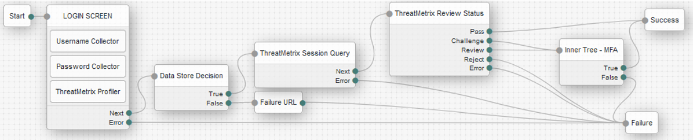

# LexisNexis Identity Proofing InstantID Question and Answer (IIDQA) Nodes
LexisNexis InstantID® Question and Answer (IIDQA) helps support speedy consumer onboarding, prevent and detect identity theft, and fortify compliance via question-based authentication tools, effectively helping organizations protect their business.  The IIDQA nodes provide the capability for administrators to integrate Knowledge Based Authentication (KBA) into on-premise Access Management authentication trees, or a ForgeRock Identity Cloud journey. 

LexisNexis IIDQA is primarily integrated into the following orchestration journeys:
- Login Multi-Factor Authetnication (MFA) for medium to high risk transactions
- New Account Origination to prevent synthetic accounts, as well as validating the account is linked to a physical person with high fidelity

## Installation
LexisNexis IIDQA Nodes are packaged as a jar file using the maven build toolset. To deploy the jar file for the nodes, perform the following:
- Download the jar from the releases tab on github [here](https://github.com/ForgeRock/tntp-threatmetrix-IIDQA/releases/latest). 
- Stop the web container to deploy the jar file
- Copy the jar into the `../web-container/webapps/openam/WEB-INF/lib` directory where AM is deployed
- Restart the web container to pick up the new nodes
- Once restart is complete, the nodes will then appear in the authentication trees components palette.

## Backwards Compatibility
LexisNexis IIDQA Nodes have been tested to be backwards compatible with ForgeRock AM v7.3.0, as well as 
available on the ForgeRock Identity Cloud. ForgeRock AM versions prior to version 7.3.0 are not supported due to changes in the ForgeRock core API.

## Quick Start Guide
In order to get started with the LexisNexis IIDQA Nodes, we have prepared a Quick Start Guides:
- Click [here](./docs/FGRK-LNRS-IIDQA-Nodes-Getting-Started-Guide-Cloud.pdf) to download a copy of the quick start guide for the ForgeRock Identity Cloud. 
- Click [here](./docs/FGRK-LNRS-IIDQA-Nodes-Getting-Started-Guide-OpenAM.pdf) to download a copy of the quick start guide for the ForgeRock Access Manager.

## Release Notes
To get the latest version of the LexisNexis IIDQA Nodes release notes, click [here](./docs/FGRK-LNRS-IIDQA-Nodes-Release-Notes.pdf) 

# Node Overview
LexisNexis InstantID® Question and Answer (IIDQA) Nodes provide the following:
- LexisNexis InstantID Get Quiz
- LexisNexis InstantID Quiz Collector
- LexisNexis InstantID Quiz Decision

## LexisNexis InstantID Get Quiz
This node calls the LexisNexis Dynamic Decision Platform (DDP) Authentication Hub for InstantID Question and Answer (IIDQA). The main purpose of this node is to call the DDP Authentication Hub to generate an IIDQA quiz. There is no interface displayed to the user by this node.

The LexisNexis IIDQA Get Quiz node is configured with an attribute mapping to gather parameters for the API Request to send to the DDP Authentication Hub for generating a knowledge based answer quiz. The attribute mapping defines the syntax to query parameters within ForgeRock that are then mapped to IIDQA attributes.  Furthermore, the node provides the capability to gather the user attributes based on the configuration of the Attribute Source, mainly User Directory or Shared State. When the user directory is configured as the source for attributes, the node will assume that the username is contained in shared state from a previous node in the authentication tree/journey and use that username to query the user directory for user parameters and fulfill the attribute mapping.  When the shared state is configured as the source for attributes, the node will inspect shared state for the user parameters to fulfill the attribute mapping.

The LexisNexis IIDQA Get Quiz Node has the following configuration parameters:
* **Org ID** - Org ID is the unique id associated your organization on the Dynamic Decision Platform (DDP).
* **API Key** - This is the unique API key generated via DDP Portal associated to the Org ID.
* **API URL** - This is the URL for the DDP Authentication Hub IIDQA API endpoint. The default URL is the Worldwide endpoint. This should be modified for specific regions such as EU, US or India.
* **Policy** - The DDP Portal policy to be used to integrate the DDP Authentication Hub with IIDQA
* **Attribute Source** - This determines where the IIDQA Get Quiz node will inspect and gather user parameters to be mapped into the attributes of the IIDQA API Request to get a quiz. This can be configured for User Directory or form Shared State. User Directory is typically configured in a orchestration where IIDQA is used for Multi-Factor Authentication (MFA) since the information for the user should be in the directory. The Shared State specification is typically configured in an orchestration where IIDQA is used for identity proofing for use cases such as new account origination since the user account does not exist.  When Shared State is used there should be an interface in the tree/journey to collect the information which stores the data in shared state.
* **Attribute List** - Defines a mapping of user parameters to InstantID Q&A API attributes. The user parameters will be fetched based on the Attribute Source. The Key is the user parameter name from the source and the value is the attribute name to send to InstantID Q&A. For example, Attribute Source=Shared State, with attribute list key=givenName and value=account_first_name would signal the LexisNexis IIDQA Get Quiz node to fetch the user parameter givenName from shared state and then set the IIDQA attribute account_first_name to the value from shared state. The attributes to send to IIDQA should include account_first_name, account_last_name, account_address_street1, account_address_city, account_address_state and account_address_zip as this will have a good probably to match a record in the LexisNexis system resulting in a generated quiz.

The LexisNexis IIDQA Get Quiz Node has the following outcomes:
* **Success** - This outcome is triggered when the API Request results in a physical match to a person based on the Attribute List and a quiz is generated. The quiz is placed into Shared State for the IIDQA Quiz Collector Node, which will display the user interface for the quiz to collect the answers.
* **API Error** - This outcome is triggered when there is an issue with the API Request such as a network timeout or the service is unavailable.
* **Discovery Error** - This outcome is triggered when a physical match to a person cannot be made based on the attribute list provided in the IIDQA API Request. In this scenario, the journey/tree may display a secondary interface to collect additional user parameters such as DOB or SSN enabling a higher probability for an identity match.
* **Velocity Error** - This outcome is triggered based on the IIDQA policy configured within LexisNexis. Typically, we configure the system to only allow 3 quiz requests over a 30 minutes period to prevent guessing attacks.
* **Error** - This outcome is triggered when there is a fundamental integration error, or a new bug is discovered. First attempt to fix the integration error by looking at debug log files for the node to determine if the integration error is due to configuration. If the configuration looks accurate, then open a support case with LexisNexis.

## LexisNexis InstantID Quiz Collector
This node displays the user interface for a quiz generated by the LexisNexis InstantID Get Quiz Node. The quiz questions are passed through shared state from the get quiz node to the quiz collector node. Once received, the interface will be displayed to the user for knowledge-based questions to be answered.  Once submitted, the answers are placed into shared memory for the LexisNexis InstantID Decision Node.

The LexisNexis IIDQA Quiz Collector Node has the following configuration parameters:
* **N/A** - There are no configuration parameters for this node.

The LexisNexis IIDQA Quiz Collector Node has the following outcomes:
* **Next** - This outcome is triggered quiz answers are complete and the submit button is selected by the user.
* **Cancel** - This outcome is triggered when the user selects the cancel button to abort the quiz.
* **Error** - This outcome is triggered when there is a fundamental integration error, or a new bug is discovered. First attempt to fix the integration error by looking at debug log files for the node to determine if the integration error is due to configuration. If the configuration looks accurate, then open a support case with LexisNexis.

## LexisNexis InstantID Quiz Decision
This node calls the LexisNexis Dynamic Decision Platform (DDP) Authentication Hub for InstantID Question and Answer (IIDQA). The main purpose of this node is to call the DDP Authentication Hub to validate answers for a quiz. There is no interface displayed to the user by this node. The quiz answers are passed through shared state from the quiz collector node to the quiz decision node. Once received, the DDP Authentication Hub IIDQA API Request is generated and API Response inspected for success or failure.

The LexisNexis IIDQA Quiz Decision Node has the following configuration parameters:
* **Org ID** - Org ID is the unique id associated your organization on the Dynamic Decision Platform (DDP).
* **API Key** - This is the unique API key generated via DDP Portal associated to the Org ID.
* **API URL** - This is the URL for the DDP Authentication Hub IIDQA API endpoint. The default URL is the Worldwide endpoint. This should be modified for specific regions such as EU, US or India.
* **Policy** - The DDP Portal policy to be used to integrate the DDP Authentication Hub with IIDQA. This policy configuration should be the same as the LexisNexis InstantID Get Quiz node configuration.

The LexisNexis IIDQA Quiz Decision Node has the following outcomes:
* **Pass** - This outcome is triggered when answers to a quiz are all passing according the DDP IIDQA policy
* **Fail** - This outcome is triggered when answers to a quiz are not passing according the DDP IIDQA policy
* **API Error** - This outcome is triggered when there is an issue with the API Request such as a network timeout or the service is unavailable.
* **Error** - This outcome is triggered when there is a fundamental integration error, or a new bug is discovered. First attempt to fix the integration error by looking at debug log files for the node to determine if the integration error is due to configuration. If the configuration looks accurate, then open a support case with LexisNexis.

# Configuring LexisNexis InstantID Question and Answer (IIDQA) Nodes
## Example Journey/Tree - IIDQA Workflow
The example depicts the general flow of IIDQA nodes. The workflow starts with the LexisNexis InstantID Get Quiz node, which does require input from previous nodes to be available in the shared state of the journey/tree. This node has been designed to support use cases for MFA of an existing managed user, as well as first time Identity Proofing for a new account origination. The key is how the LexisNexis IIDQA Get Quiz node gathers parameters from the ForgeRock environment, mainly from a user credential store to support MFA workflows, or from a user interface and shared state to support new account origination workflows. The configuration of the LexisNexis InstantID Get Quiz node will define the data source via the Attribute Source, which when set to User Directory will inspect shared state for "username" and when set to Shared State will inspect for all user parameters in shared state as defined in the Attribute List. The example depicted below is the core processing tree for InstantID Question and Answer, which is meant to be called from a ForgeRock Inner Tree from higher level journey/tree.

The flow is as follows:
•	LexisNexis IIDQA Get Quiz Node. The configuration determines whether to pull user parameters from: (i) a user credential store, or (ii) from ForgeRock shared state in the journey/tree.
•	LexisNexis IIDQA Quiz Collector Node. This node will display the quiz generated via the LexisNexis IIDQA Get Quiz Node. The user is expected to select the correct answers and click the submit button.
•	LexisNexis IIDQA Quiz Decision Node to determine if the quiz answers collected from the user are valid and pass the test.
•	Page Nodes with messages and a single OK button that will display the results and/or error conditions.

## Example Journey/Tree - IIDQA as Identity Proofing
InstantID Question and Answer (IIDQA) technology can be used for Identity Proofing within a New Account Origination (NAO) workflow. This is done to validate the digital account is tied to a physical user, where the physical user information is validated, cutting down on synthetic accounts. The example depicted below shows how an existing journey/tree controlling Platform Registration can be modified to include IIDQA for Identity Proofing. The key is the ForgeRock Inner Tree Evaluator node at the correct location in the journey/tree to call out to the IIDQA Workflow. For this use case, the IIDQA Workflow would be configured to fetch user parameters from Shared State, where the Platform Registration would have the user interface to gather the parameters and place those into Shared State.

## Example Journey/Tree - IIDQA as Second Factor / MFA
InstantID Question and Answer (IIDQA) technology can be used as a second factor (e.g. MFA) for many workflows and journeys. One common scenario is a User Login when a second factor for a high-risk transaction is needed.  In this case, the user is known due to the first factor authentication, as well as it is assumed that user has enough information within the user credential store to perform an IIDQA transaction. The key is the ForgeRock Inner Tree Evaluator node at the correct location in the journey/tree to call out to the IIDQA Workflow. For this use case, the IIDQA Workflow would be configured to fetch user parameters from the User Directory. The username is required to be in shared state which will be used to query the user directory for all user parameters as defined in the Attribute List.

